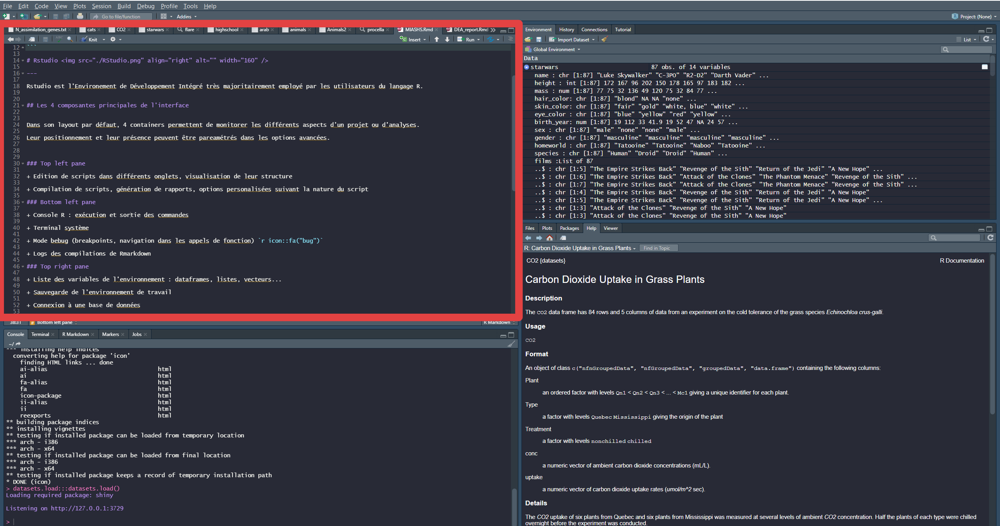
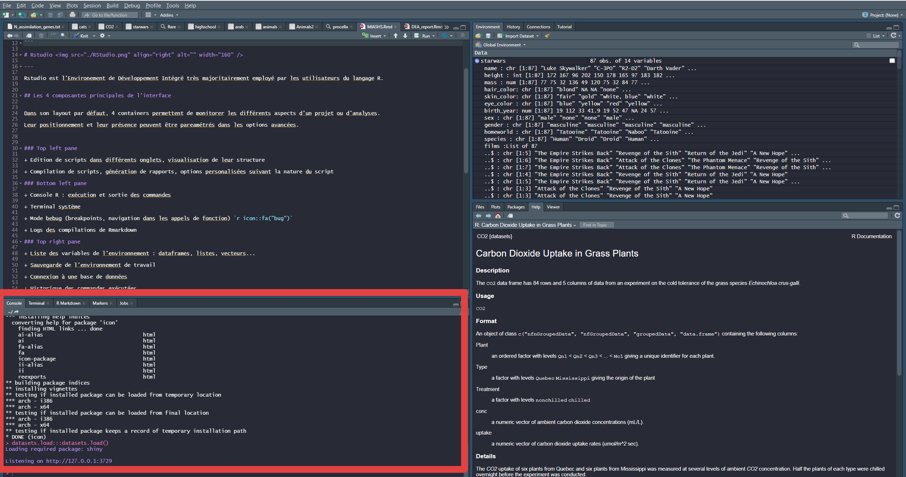
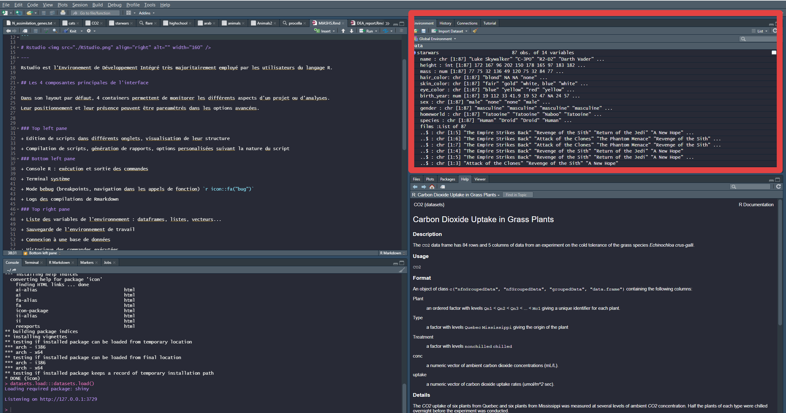
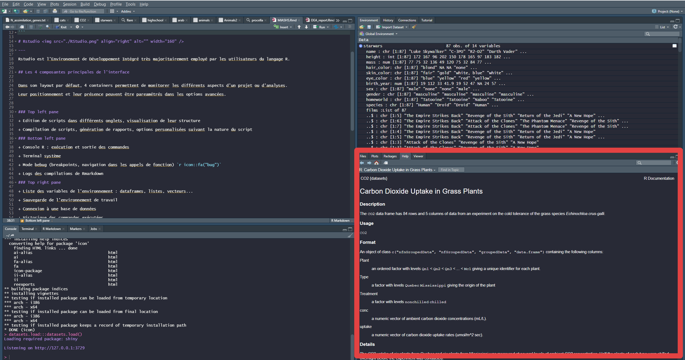
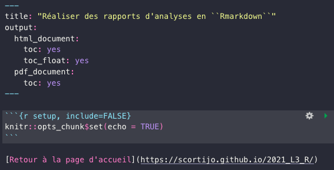
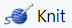

```{r setup, include=FALSE}
knitr::opts_chunk$set(echo = TRUE)
```


<style>
  .col2 {
    columns: 2 200px;         /* number of columns and width in pixels*/
    -webkit-columns: 2 200px; /* chrome, safari */
    -moz-columns: 2 200px;    /* firefox */
  }
  .col3 {
    columns: 3 100px;
    -webkit-columns: 3 100px;
    -moz-columns: 3 100px;
  }
  .spoiler div {
    display: none;
  }
  .spoiler p {
    color: darkred;
  }
  
  .spoiler:hover div {
    display: block;
  }
</style>


# `RStudio`  {.tabset .tabset-fade}


---

`RStudio` est l’Environnement de Développement Intégré très majoritairement employé par les utilisateurs du langage R.


## Les composantes principales de l'interface


Dans son layout par défaut, lorsqu'un script est ouvert, 4 containers permettent de monitorer les différents aspects d'un projet ou d'analyses.

Leur positionnement et leur présence peuvent être paramétrés dans les options avancées.

Dans chaque container, différents onglets permettent d'accéder aux fonctionnalités proposées.

---
 
<div class="col2">

**Rédaction de scripts**

+ Edition de scripts dans différents onglets, visualisation de leur structure

+ Possibilité d'ouverture de scripts dans différentes fenêtres

+ Compilation de scripts, génération de rapports, options personalisées suivant la nature du document

<a href="./Images/topleft.PNG" >

</a>


</div>

---

<div class="col2">

**Console**

+ Console R : exécution et affichage de la sortie des commandes

+ Terminal du système (monitorat de l'utilisation mémoire, git en ligne de commande, etc)

+ Mode bebug (breakpoints, navigation dans les appels de fonction) 

+ Logs des compilations de `Rmarkdown`


<a href="./Images/botleft.PNG" >

</a>

</div>

---

<div class="col2">

**Environnement**

+ Liste des variables de l'environnement : aperçu des dataframes, listes, vecteurs...

+ Sauvegarde de l'environnement de travail

+ Connexion à une base de données

+ Historique des commandes exécutées

+ Interface pour git


<a href="./Images/topright.PNG" >
   
</a>


</div>

---

<div class="col2">

**Fichiers et apperçus graphiques**

+ Navigateur de fichiers, setting du répertoire de travail

+ Affichage des graphiques générés par le code et de leur historique

+ Liste des packages installés et loadés dans la session courante

+ **Documentation des packages installés**

+ Aperçu de documents html


<a href="./Images/botright.PNG" >

</a>

</div>

---

## Tips et remarques complémentaires sur `RStudio` et R

+ Beaucoup de paramètres sont accessibles à l'utilisateur dans les options globales de `RStudio` pour l'édition du code, l'apparence de l'interface, le lien avec le terminal ou git, la compilation de `Rmarkdown`...

+ Des raccourcis claviers existent pour la majorité des actions, la liste étant disposnible avec `Alt+Shift+K` ou Option+Shift+K. Des raccourcis personnalisés peuvent être créés.

+ Travaillez sous le format "Projet" pour la gestion automatique des répertoires de travail, des environnements, etc

+ `RStudio` peut être agrémenté d'Addins, des extensions constituant des aides pour des tâches de programmation. Par exemple : un color picker, une interface pour ggplot2, une aide à la citation de références, des code organizers...

+ User et abuser de l'autocomplétion lors de l'écriture de scripts (nom de fonctions, arguments de fonctions, variables...)

+ Obtenez de l'aide sur n'importe quelle fonction dans la console avec ?, par exemple `?ggplot`.

+ Plusieurs sessions R indépendantes peuvent être lancées simultanément (travail en parallèle, ou dans différents projets)

+ `RStudio` s'intègre avec Git et le développement de packages avec des onglets spécifiques dans la composante en haut à droite

+ Une [cheat-sheet très complète sur l'interface](https://raw.githubusercontent.com/rstudio/cheatsheets/master/rstudio-ide.pdf) `RStudio`

+ La communauté des utilisateurs de `R` et `RStudio` est très active et développée : https://community.RStudio.com/ est un forum d'échange et d'aide aux développeurs. Des groupes comme [RWeekly](https://rweekly.org/), [SatRdays](https://satrdays.org/), effectuent des conférences régulièrement et communiquent sur les réseaux sociaux, sur les nouveautés liées à R.


# Rédaction de rapports avec `Rmarkdown`  {.tabset .tabset-fade}

---

## Quelques notions

Lors de cette séance nous allons apprendre à rédiger des rapports d'analyse en ``Rmarkdown``. L'idée n'est plus de produire de simples scripts (des documents en ``.R`` comme vous en avez déjà probablement codés), mais **des documents partageables et lisibles par tout le monde**, y compris les personnes ne sachant pas programmer en R. Ces documents contiendront des explications, du contexte, vos lignes de code R, et leurs sorties (les graphiques générés par exemple). 

Plus précisément, [`Rmarkdown`](https://rmarkdown.rstudio.com/) est une syntaxe permettant la rédaction de documents HTML, PDF, MS World, ou d'autres formats.
Il est possible d'y inclure du code R comme dans un script classique, mais également ses sorties, et en les encapsulant dans un rapport en structuré et fourni en descriptions, interprétations textuelles, liens, images...


<center></center>


### Pourquoi utliliser du `Rmarkdown`?

+ Ce format permet la **communication** de méthodes et de résultats de manière claire et commentée, particulièrement à des non spécialistes de l'informatique ou des statistiques.

+ La **reproductibilité** des analyses est garantie, car le code ayant généré les résultats montrés est présent, et peut être réexécuté par toute personne possédant le document.

<center></center>

> En résumé, ce format favorise l'intégrité scientifique des travaux impliquant du code R.


### Structure d'un document et fonctionnement

Un document ``Rmarkdown`` comprend 3 types de contenu : 

+ Une **entête** (ou header) au format YAML (Yet Another Markup Langage), au tout début du document, qui donne les paramètres du document (type de format (pdf, HTML), l'auteur, la date, le thème, un fichier de bibliographie...). Il est entouré des délimiteurs ``---`` .

+ Des morceaux de code appelés **chunks**, dans lesquels le code R est placé et peut être exécuté. 


+ Des parties rédigées avec la syntaxe **markdown**. Il s'agit de texte enrichi de titres, sous titres, listes, insertion d'images, de liens, etc. Une description de cette syntaxe est également disponible dans la [documentation](https://rstudio.com/wp-content/uploads/2015/03/rmarkdown-reference.pdf?_ga=2.116494478.901299713.1598125979-1765392125.1580035352). De plus, la [syntaxe Latex](https://en.wikibooks.org/wiki/LaTeX/Mathematics) peut être utilisée pour faire le rendu d'équations mathématiques.

Vous avez ci-dessous un aperçu de ces trois composants, c'est à dire une entête, un chunk de code R, et une partie textuelle en markdown : 



La syntaxe complète de Rmarkdown, dont vous allez avoir besoin par la suite, est dans cette [antisèche](https://www.rstudio.com/wp-content/uploads/2015/02/rmarkdown-cheatsheet.pdf), que vous pouvez garder ouverte au cours du TP.


L'édition de `Rmarkdown` se fait généralement sous `RStudio`, qui propose une interface de Notebook, permettant d'exécuter les chunks de code R souhaités, tout en rédigeant la partie textuelle en markdown. 

Pour compiler un document, on utilise le bouton . Le logiciel `knitr` est alors utilisé pour créer un document contenant le code et ses sorties, avec le reste du texte, puis le logiciel `pandoc` se charge de donner au document son format et apparence finale (HTML, PDF...). 


Généralement, le premier chunk contient la fonction ```knitr::opts_chunk$set(echo = TRUE)```, qui peut être utilisée pour préciser des paramètres qui seront utilisés pour tous les chunks du document.

Toutes les options de chunks sont décrites dans la [documentation de `Rmarkdown`](https://RStudio.com/wp-content/uploads/2015/03/Rmarkdown-reference.pdf?_ga=2.116494478.901299713.1598125979-1765392125.1580035352).


## Partie pratique

Maintenant, à vous de générer un rapport d'analyses.
L'idée est de générer un rapport identique à [celui- ci](https://oceanecsn.github.io/M1_Rmarkdown_course/) pour illustrer les fonctionnalités de `Rmarkdown`.

Tout d'abord, nous aurons besoin de certains packages. 
Assurez-vous de leur installation avant de commencer. Pou cela, dans la console R, exécutez la commande suivante qui fera les installations des packages manquants uniquement :

```{r, eval=FALSE}
packages <- c("ggplot2", "ggpubr", "gglm", "equatiomatic", "papeR", "knitr", "plotly")
install.packages(setdiff(packages, rownames(installed.packages())))  
``` 

<div class="spoiler">
  <p> Informations sur les packages </p>
  <div id="spoiler_content">
  
  **ggplot2** : visualisation de données
  
  **ggpubr** : extensions à ggplot pour des graphes prêts à la publication
  
  **equatiomatic** : donne la formule d'un modèle de régression en formule latex
  
  **papeR** : formate des résultats de summary de modèles de régression
  
  **gglm** : graphes des résidus d'un modèle de régression
  
  **knitr** : outils pour la compilation de documents Rmd
  
  **plotly** : makes ggplot graphs interactive

  </div>
</div>


### Initialisation de l'environnement de travail.

+ Ouvrez `RStudio` et créez un nouveau projet (File/New Project.../New Directory).
Choisissez un emplacement et créez votre projet. A la racine du projet, créez un folder `data`, dans lequel vous devez [télécharger les données](https://raw.githubusercontent.com/OceaneCsn/M1_Rmarkdown_course/master/data/burghardt_et_al_2015_expt1.csv) que nous allons utiliser aujourd'hui.

+ Créez un nouveau document `Rmarkdown` qui sera votre script de TP, via le menu File/New file/R Markdown (acceptez les éventuelles mises à jour). Laissez l'option HTML par défaut. Comme vous le constatez, `RStudio` propose déjà un petit template d'exemple fonctionnel de `Rmarkdown`. Vous pouvez le sauvegarder et le compiler avec le bouton . Inspectez le résultat obtenu, ainsi que le code l'ayant généré.

+ Personnalisez l'entête YAML (auteur, titre, date...). 

+ Le premier chunk de setup doit être conservé.  Observez la première ligne du premier chunk de code. Un chunk prend en option le langage utilisé (`r`), un nom éventuel (ici `setup`), ainsi qu'un certain nombre de paramètres. En l'occurrence, par défaut, cette fonction impose ```echo = TRUE``` pour tous les chunks du document.


Rajoutez-y l'import des packages que nous allons utiliser. Il doit donc maintenant contenir : 

```{r, eval=FALSE}
knitr::opts_chunk$set(echo = TRUE)
library(ggplot2)
library(ggpubr)
library(equatiomatic)
library(papeR)
library(gglm)
library(plotly)
```

Nous continuerons de le modifier plus tard dans l'énoncé. Exécutez ce chunk avec la petite flèche verte en haut à droite, ou avec `Ctrl+Shift+Enter`.

La suite du template peut être supprimée, car nous allons la remplacer par nos propres analyses.

Au cours des étapes suivantes, utilisez régulièrement  pour compiler et visualiser le rendu du document.


### Donner le contexte et importer les données

Créez une première section nommée "Contexte" (`# Contexte`) et rappelez l'objectif du document (vous familiariser avec `Rmarkdown`). Vous pouvez également parler des données que nous allons utiliser comme base de notre démonstration : es données analysées sont issues d'une [publication](https://nph.onlinelibrary.wiley.com/doi/10.1111/nph.13799) intitulée "Fluctuating, warm temperatures decrease the effect of a key floral repressor on flowering time in Arabidopsis thaliana" de 2015.

Ajoutez un lien vers cette publication en ligne.

Dans ces données, plusieurs génotypes d'*Arabidopsis thaliana*, une plante modèle, ont été phénotypés (leurs caractéristiques morphologiques, leur réponse à l'environnement, ont été mesurés).

Dans le premier chunk de votre document (Créez un nouveau chunk  avec `Ctrl + Alt + I` ou avec le bouton de l'interface ). Vous pouvez loader le jeu de données ainsi, puis l'inspecter rapidement :

```{r eval=FALSE}
data <- read.csv("data/burghardt_et_al_2015_expt1.csv")
dim(data)
head(data)
```

La fonction `dim` donne les dimensions du dataframe, et `head` donne un perçu de ses premières lignes.

Exécutez un chunk avec la petite flèche verte en haut à droite, ou avec `Ctrl+Shift+Enter`.
Après exécution, un objet data est apparu dans votre environnement `RStudio`. Vous pouvez l'inspecter avec la commande `View(data)` dans la console.


Compilez pour observer le document HTML et l'affichage des données .

### Affichage `paged` des dataframes

Pour améliorer le rendu des dataframes (comme ce que renvoie la fonction `head`, on va utiliser l'option d'affiche `paged` dans la partie YAML. Inspirez vous de cette entête : 

```{yaml}
---
title: "Visualisation et analyse de données de biologie végétale"
output:
  html_document:
    df_print: paged
---
```

Ajoutez l'option et re-compilez pour vérifier le résultat sur la sortie de `head`.


### Visualisation

Créez une section `# Visualisation`.

Créez ensuite une sous-section `## Simple visualisation`. 

Nous allons ici représenter le nombre de jours jusqu'à floraison pour les différents génotypes, durée de jours (qui peuvent être contrôlés dans des chambres artificielles), et la température de culture. Voici le code à utiliser pour réaliser le graphique, utilisant la librairie ggplot2 :

```{r, eval=FALSE}
data$temperature <- factor(data$temperature)
data$day.length = factor(data$day.length)

ggplot(data, aes(x = factor(temperature), 
                 y = days.to.flower, 
                 color = genotype )) + 
  geom_jitter(color = "black")+ 
  geom_boxplot(aes(fill = genotype), alpha = 0.3, size = 1) +
  facet_grid(day.length~genotype) + 
  xlab("Temperature")
```


Exécutez le chunk, et compilez le document.

En dessous du chunk permettant de générer le graphe, interprétez la visualisation.

### Changement de la taille d'une image


L'image est de taille assez petite. De manière globale à tout le document, demandez des images de hauteur 8 et de largeur 12. Pour cela, ajoutez des paramètres `fig.width` et `fig.height` à la fonction ```knitr::opts_chunk$set(echo = TRUE)``` dans le premier chunk.

Recompliez le document pour vérifier que le changement de taille a bien eu lieu.


### Ajout des tests statistiques sur la visualisation

On constate qu'une température plus élevée aura tendance à diminuer le temps nécessaire à la floraison. Il s'agit ici de reproduire le même graphe mais en se demandant si les durées jusqu'à floraison sont significativement impactées par la température. La fonction ```stat_compare_means``` du package ```ggpubr``` permet de rajouter un test de comparaison de moyennes (ici non paramétrique, le wilcox.test). Pour plus d'informations sur la fonction, tapez `?stat_compare_means` dans la console.

Créez une sous-section `## Visualisation avec tests statistiques`

Ajoutez en dessous un nouveau chunk contenant : 

```{r, eval=FALSE}
comparisons <- list(c("12", "22"))
ggplot(data, aes(x = temperature, 
                 y = days.to.flower, 
                 color = genotype )) + 
  geom_jitter(color = "black")+ 
  geom_boxplot(aes(fill = genotype), alpha = 0.3, size = 1) +
  facet_grid(day.length~genotype) + 
  xlab("Temperature") + 
  stat_compare_means(comparisons = comparisons, label = "p.signif")
```


### Utiliser des onglets pour organiser les sous-sections

Nous allons maintenant faire comme dans ce sujet de TP et positionner chacune des sous-sections dans deux onglets. Pour cela, il suffit de spécifier des options à la section supérieure `# Visualisation`, qui devient `# Visualisation {.tabset .tabset-fade}`

Compilez et inspectez le résultat.

### Régression


On va essayer d'expliquer le nombre de feuilles d'une plante au moyen du temps qu'elle a mis a fleurir, et de la longueur des jours lors de la culture.
Dans une nouvelle section, expliquez l’objectif et affichez la relation entre le nombre de feuilles et le temps jusqu'à floraison. On distingue les observations réalisées en jours courts ou en jours longs par la couleur:


```{r, eval=FALSE}
ggplotly(ggplot(data, aes(x = days.to.flower, 
                 y = rosette.leaf.num, 
                 color = day.length)) + geom_point())
```


Vous remarquez ici que la fonction `ggplotly` permet de rendre interactif le graphe ggplot.

On réalise la régression au moyen de la fonction `lm`, puis on extrait et on affiche en syntaxe latex l'équation de ce modèle linéaire : 

```{r, eval=FALSE}
lm <- lm(data = data, rosette.leaf.num~days.to.flower*day.length)
extract_eq(lm)
```

Compilez pour admirer le rendu de l'équation.

Vérifiez si le modèle linéaire semble correct et interprétable au moyen des graphes sur les résidus (fonction `gglm`), puis affichez les résultats du modèle dans une table interactive (fonction `prettify`) : 

```{r, eval=FALSE}
gglm(lm)
prettify(summary(lm))
```

Concluez sur les résultats du summary quant à l'effet du temps jusqu'à floraison et de la longueur du jour sur le nombre de feuilles (n'oubliez pas la signification du terme d’interaction). Que nous apprend cette régression?


### Supression des messages et warnings

Les données manquantes pour certaines observations et certaines fonctions génèrent des warnings lors de l'exécution du code. Pour qu'ils n'apparaissent pas dans le document final, ajoutez un paramètre global dans le premier chunk spécifiant de ne pas rapporter les warnings ni les messages.

*Attention, ne faire ça qu'en fin d'édition, et lorsque l'on est sûr que ces messages et warnings ne sont pas problématiques, ni des informations importantes.*


### Personnaliser l'apparence du document

Les couleurs globales du document (liens, couleur de fond, table des matières, etc) peuvent être modifiées. Ceci aura de nouveau lieu dans l'entête YAML de votre document, en utilisant les options `theme` et `highlight`. 


Plus précisément, vous avez le choix entre les thèmes  `cerulean`, `cosmo`, `flatly`, `journal`, `lumen`, `paper`, `readable`, `sandstone`, `simplex`, `spacelab`, `united`, et `yeti`, dont un aperçu est disponible [ici](https://www.datadreaming.org/post/r-markdown-theme-gallery/).


Le `hihhlight` correspond à la coloration syntaxique du code R dans les chunks, vous avez le choix entre les valeurs `default`, `tango`, `pygments`, `kate`, `monochrome`, `espresso`, `zenburn`, `haddock`, `breezedark`, and `textmate`.

Choisissez vos valeurs de `theme` et `hihhlight` préférées et ajoutez les à votre document en vous inspirant de cette entête :


```{yaml}
---
title: "Analyse de la floraison chez *Arabidopsis thaliana*"
author: "Etudiant MIASHS"
date: "8/17/2021"
output:
  HTML_document:
    theme: united
    highlight: breezedark
---
```

### Section de bibliographie


Ajoutez une référence bibliographique pour référencer la publication relative aux données analysées. Vous pouvez procéder comme suit :

+ Téléchargez le [fichier contenant les informations de la référence](https://raw.githubusercontent.com/OceaneCsn/M1_Rmarkdown_course/master/data/biblio.bib) (format .bib) et placez le dans le folder data du projet. Inspectez le pour comprendre ce qu'il contient.

+ Ajouter dans l'entête YAML un champs `bibliography: data/biblio.bib`
Comme dans cet exemple:

```{yaml}
---
title: "Visualisation et analyse de données de biologie végétale"
output:
  html_document:
    theme: united
bibliography: ./data/biblio.bib
---
```

+ Citez cette référence dans votre section contexte comme suit: `[@Burghardt2015]` (en effet, la syntaxe de citation est `[@label de la référence dans le .bib]`).

+ Ajoutez une dernière section `# Références` vide à la fin du document, car les références sont automatiquement ajoutées en fin de document.
Recompilez et pour vérifier que la référence apparaît bien en fin de document, et qu'elle est bien référencée à l'endroit du contexte, où vous la citez.

Plus de détails sur les citations sont disponibles [ici](https://rmarkdown.rstudio.com/authoring_bibliographies_and_citations.html).

### Ajouter un footer

Pour reproduire le pied de page de ce sujet (Nom de l'auteur, lien vers son site personnel/github, etc), vous pouvez créer un document `footer.html` à la racine du projet en vous inspirant de [celui ci](https://raw.githubusercontent.com/OceaneCsn/M1_Rmarkdown_course/master/footer.html).
Incluez le ensuite au document comme suit:


```{yaml}
---
title: "Visualisation et analyse de données de biologie végétale"
output:
  html_document:
    includes:
      after_body: footer.html
---
```

A la fin de ces guidelines, vous devriez avoir un document très proche de la [solution]((https://oceanecsn.github.io/M1_Rmarkdown_course/)!


