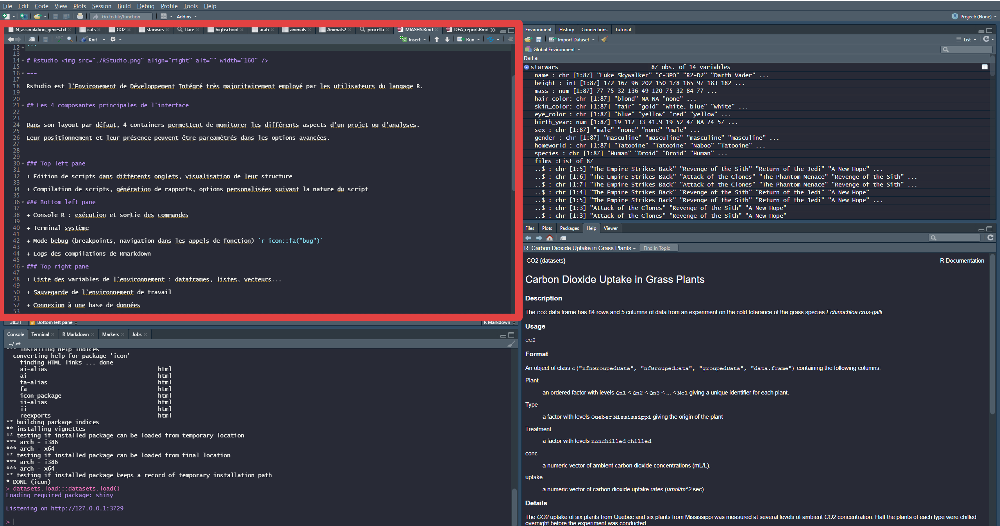
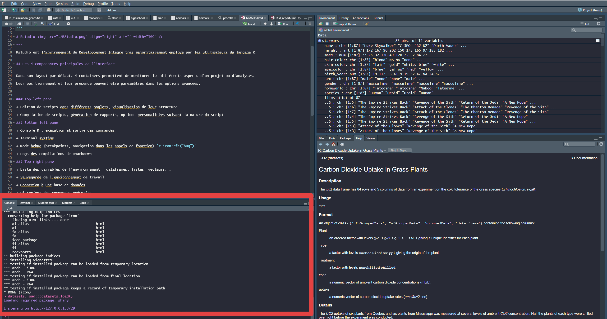
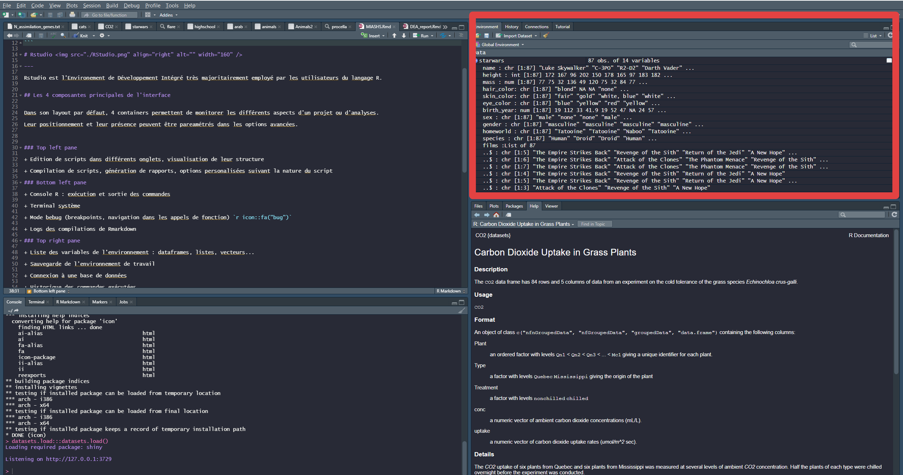

```{r setup, include=FALSE}
knitr::opts_chunk$set(echo = TRUE)
```


<style>
  .col2 {
    columns: 2 200px;         /* number of columns and width in pixels*/
    -webkit-columns: 2 200px; /* chrome, safari */
    -moz-columns: 2 200px;    /* firefox */
  }
  .col3 {
    columns: 3 100px;
    -webkit-columns: 3 100px;
    -moz-columns: 3 100px;
  }
  .spoiler div {
    display: none;
  }
  .spoiler p {
    color: darkred;
  }
  
  .spoiler:hover div {
    display: block;
  }
</style>


# RStudio 

---

Rstudio est l'Environement de Développement Intégré très majoritairement employé par les utilisateurs du langage R.


## Les composantes principales de l'interface


Dans son layout par défaut, lorsqu'un script est ouvert, 4 containers permettent de monitorer les différents aspects d'un projet ou d'analyses.

Leur positionnement et leur présence peuvent être paramétrés dans les options avancées.

Dans chaque container, différents onglets permettent d'accéder aux fonctionnalités proposées.

---
 
<div class="col2">

**Rédaction de scripts**

+ Edition de scripts dans différents onglets, visualisation de leur structure

+ Possibilité d'ouverture de scripts dans différentes fenêtres

+ Compilation de scripts, génération de rapports, options personalisées suivant la nature du document

<a href="./Images/topleft.PNG" >

</a>


</div>

---

<div class="col2">

**Console**

+ Console R : exécution et affichage de la sortie des commandes

+ Terminal du système (monitorat de l'utilisation mémoire, git en ligne de commande, etc)

+ Mode bebug (breakpoints, navigation dans les appels de fonction) 

+ Logs des compilations de Rmarkdown


<a href="./Images/botleft.PNG" >

</a>

</div>

---

<div class="col2">

**Environnement**

+ Liste des variables de l'environnement : aperçu des dataframes, listes, vecteurs...

+ Sauvegarde de l'environnement de travail

+ Connexion à une base de données

+ Historique des commandes exécutées

+ Interface pour git


<a href="./Images/topright.PNG" >
   
</a>


</div>

---

<div class="col2">

**Fichiers et apperçus graphiques**

+ Navigateur de fichiers, setting du répertoire de travail

+ Affichage des graphiques générés par le code et de leur historique

+ Liste des packages installés et loadés dans la session courante

+ **Documentation des packages installés**

+ Aperçu de documents html


<a href="./Images/botright.PNG" >

</a>

</div>

---

## Tips et remarques complémentaires sur RStudio et R

+ Beaucoup de paramètres sont accessibles à l'utilisateur dans les options globales de RStudio pour l'édition du code, l'apparence de l'interface, le lien avec le terminal ou git, la compilation de Rmarkdown...

+ Des raccourcis claviers existent pour la majorité des actions, la liste étant disposnible avec Alt+Shift+K ou Option+Shift+K. Des raccourcis personalisés peuvent être créés.

+ Travaillez sous le format "Projet" pour la gestion automatique des répertoires de travail, des environnements, etc

+ RStudio peut être agrémenté d'Addins, des extensions constituant des aides pour des tâches de programmation. Par exemple : un color picker, une interface pour ggplot2, une aide à la citation de références, des code organizers... Voici [La liste des plus utilisés](<https://cran.r-project.org/web/packages/addinslist/readme/README.html>)

+ User et abuser de l'autocomplétion lors de l'écriture de scripts (nom de fonctions, arguments de fonctions, variables...)

+ Obtenez de l'aide sur n'importe quelle fonction dans la console avec ?, par exemple `?ggplot`.

+ Plusieurs sessions R indépendantes peuvent être lancées simultanément (travail en parallèle, ou dans différents projets)

+ RStudio s'intègre avec Git et le développement de packages avec des onglets spécifiques dans la composante en haut à droite

+ Une cheat-sheet très complète sur l'interface RStudio : <https://raw.githubusercontent.com/rstudio/cheatsheets/master/rstudio-ide.pdf>

+ La communauté des utilisateurs de R/RStudio est très active et développée : <https://community.rstudio.com/> est un forum d'échange et d'aide aux développeurs. Des groupes comme [RWeekly](https://rweekly.org/), les [Rladies](https://rladies.org/), [SatRdays](https://satrdays.org/), effectuent des conférences régulièrement et communiquent sur les réseaux sociaux, sur les nouveautés liées à R.


# Rédaction de rapports avec Rmarkdown 

---

## Quelques notions

[Rmarkdown](http://rmarkdown.rstudio.com) est une syntaxe permettant la rédaction de documents HTML, PDF, Word, de slides, parmi d'autres formats.
Il est possible d'y inclure du code R et ses sorties, en les encapsulant dans un rapport en markdown structuré, accompagné de description et d'interprêtations textuelles, de liens, d'images...


### Pourquoi utliliser du Rmarkdown?

+ Ce format permet la **communication** de méthodes et de résultats de manière claire et commentée, particulièrement à des non spécialistes de l'informatique ou des statistiques.

+ La **reproductibilité** des analyses est garantie, car le code ayant généré les résultats montrés est présent, et peut être réexécuté par toute personne possédant le document.

### Fonctionnement

L'édition de Rmarkdown se fait généralement sous RStudio, qui propose une interface de Notebook, permettant d'exécuter les chunks de code R souhaité, tout en rédigeant la partie textuelle en markdown. 

Pour créer le document fini, on utilise le bouton **knitr**. Le logiciel knitr est alors utilisé pour créer un document markdown contenant le code et ses sorties, avec le reste du texte, puis le logiciel pandoc se charge de donner au document son format et apparence finale (html, pdf...). 


### Structure d'un document

+ Un **header** du format YAML (Yet Another Markup Langage) qui donne les paramètres du document (type de format (pdf, html), l'auteur, la date, le thème, des paramètres pour le code R, un fichier de bibliographie...). Il est entouré des délimiteurs --- .  Par exemple, l'entête YAML de ce document est :


```{}
---
title: "L'IDE RStudio et l'édition de documents Rmarkdown"
author: "Océane Cassan - oceane.cassan@cnrs.fr"
date: "8/15/2020"
output:
  html_document:
    theme: united
---
```

+ Des morceaux de code appelés **chunks**, dans lesquels les analyses et les calculs en R sont menés. Un chunck prend en option le langage utilisé, ainsi qu'un certain nombre de paramètres. Par example, ```include = FALSE``` ne fait pas apparaître le code ni les résultats dans le document fini. ```echo = FALSE``` montre les sorties du code mais pas le code lui même. ```fig.cap = "Ma figure"``` attribue la légende désirée à une figure générée par le chunk. 

Généralement, le premier chunk contient la fonction ```knitr::opts_chunk$set(echo = TRUE)```, qui peut être utilisée pour préciser des paramètres qui seront utilisés pour tous les chunks du document.

Toutes les options de chunks sont décrites dans la [documentation de Rmarkdown](https://rstudio.com/wp-content/uploads/2015/03/rmarkdown-reference.pdf?_ga=2.116494478.901299713.1598125979-1765392125.1580035352).


+ Des parties rédigées avec la syntaxe **markdown**. Il s'agit de texte brut enrichi de titres, sous titres, listes, insertion d'images, de liens, etc. Une description de cette syntaxe est également disponible dans la [documentation](https://rstudio.com/wp-content/uploads/2015/03/rmarkdown-reference.pdf?_ga=2.116494478.901299713.1598125979-1765392125.1580035352). De plus, la [syntaxe Latex](https://en.wikibooks.org/wiki/LaTeX/Mathematics) peut être utilisée pour faire le rendu d'équations mathématiques.


La syntaxe de Rmarkdown dont vous allez avoir besoin par la suite est dans cette [cheat sheet](<https://raw.githubusercontent.com/rstudio/cheatsheets/master/rmarkdown-2.0.pdf>), vous pouvez garder ce document ouvert au cours du TP.


## Partie pratique

Maintenant, à vous de générer un rapport d'analyses.


Tout d'abord, nous aurons besoin de certains packages. 
Assurez-vous de leur installation avant de commencer. Pou cela, dans la console R, exécutez la commande suivante qui fera les installations des packages manquants uniquement :

```{r, eval=FALSE}
packages <- c("ggplot2", "ggpubr", "gglm", "equatiomatic", "papeR")
install.packages(setdiff(packages, rownames(installed.packages())))  
``` 

<div class="spoiler">
  <p> Informations sur les packages </p>
  <div id="spoiler_content">
  
  **ggplot2** : visualisation de données
  
  **ggpubr** : extensions à ggplot pour des graphes prêts à la publication
  
  **equatiomatic** : donne la formule d'un modèle de régression en formule latex
  
  **papeR** : formatte des résultats de summary de modèles de régression
  
  **gglm** : graphes des résidus d'un modèle de régression

  </div>
</div>


Dans RStudio, vous pouvez créer un nouveau document Rmarkdown via le menu File/New file/R Markdown (acceptez les éventuelles mises à jour). Laissez l'option HTML par défaut, que nous allons développer aujourd'hui.


Au cours des étapes suivantes, utiliser knitr pour compiler et visualiser le rendu actuel du document.

0. Personnalisez le template dnas l'entête YAML (auteur, titre...). Le premier chunk de setup doit être conservé. La suite du template peut être modifié pour effectuer le TP.


Le support  de ce TP est un jeu de données décrivant diverses caractéristiques des personnages des films **Star Wars**, que nous allons explorer afin prendre en main les principales fonctionnalités présentées plus haut.


1. Créez une première section nommée "Contexte" et rappelez l'objectif du document. Vous pouvez également introduire l'univers Star Wars selon votre envie. Incluez le [lien de l'API](https://swapi.dev/) qui a permis de constituer ces données.

Dans le premier chunk de votre document ( Ctrl + Alt + I, OS X: Cmd + Option + I), vous pouvez loader le jeu de données ainsi :

```{r eval=FALSE}
library(dplyr)
data(starwars)
```

Exécutez un chunk avec la petite flèche verte en haut à droite, ou avec Ctrl+Shift+Enter.
Après exécution, un objet starwars est apparu dans votre environnement RStudio. 

2. Dans une nouvelle section et un nouveau chunk, affichez un aperçu du dataframe starwars : ``` head(starwars)```. Le formatage de base peut être amélioré avec la fonction ``` knitr::kable(head(starwars))```.


3. Créez une section visualisation. Nous allons ici représenter la masse des personnages en fonction de leur taille. Voici le code à utiliser, utilisant la librarie ggplot2 :

```{r, eval=FALSE}
library(ggplot2)
ggplot(starwars, aes(x = height, y = mass, label = name)) + 
  geom_text(size = 3, alpha = 0.5)+ 
  geom_point(size = 2, aes(color = name)) + theme(legend.position = "none") + 
  ggtitle("Masse en fonction de la taille des personnages de Star Wars")
```


4. L'image est de taille assez petite. De manière générique à tout le document, demandez des images de hauteur 9 et de largeur 9. Pour cela, ajoutez des paramètres à ```knitr::opts_chunk$set(echo = TRUE)``` en début de document.

5. Les données manquantes pour certains personnages génèrent des warnings lors de la génération du graphique. Pour qu'ils n'apparaissent pas dans le document, ajoutez un paramètre au chunk spécifiant de ne pas rapporter les warnings.

6. Vous devriez remarquer un clair outlier. En dehors du chunk, Ecrivez son nom en gras, et incluez sa photo comme indiqué dans la documentation de la syntaxe markdown.
Si vous utilisez un chemain relatif, l'image doit être dans le même folder que votre document .Rmd. Sinon, vous pouvez utiliser un chemain absolu ou une url. Nous allons représenter de nouveau les données en retirant l'outlier avec le code suivant :

```{r, eval=FALSE}
library(stringr)
starwars_filtered <- starwars[!str_detect(starwars$name, "Jabba"),]

ggplot(starwars_filtered, aes(x = height, y = mass, label = name)) + 
  geom_text(size = 4, alpha = 0.5)+ 
  geom_point(size = 3, aes(color = sex)) +
  ggtitle("Masse en fonction du poids des personnages de Star Wars") + 
  geom_smooth() + scale_color_brewer(palette = "Set2") 
```

Ici, la couleur des points correspond au genre des personnages, et une interpolation a été ajoutée.

7. Tous les personnages ne se sont pas rencontrés et ne sont pas apparus dans les mêmes films. Nous proposons ici de construire un réseau de co-occurrence dans lequel les personnages (noeuds du réseau), sont connectés par une arête si ils apparaissent dans au moins MIN_SHARED_FILMS films en commun (2 par défaut, mais vous pouvez le faire varier pour explorer un peu).

```{r, eval=FALSE}
# creation des paires de personnages
pairs <- data.frame(t(combn(starwars$name, m = 2)))

# fonction qui donne le nombre de films en commun pour deux personnages
get_common <- function(pair){
  c1 <- strsplit(pair,'+', fixed = T)[[1]][1]
  c2 <- strsplit(pair,'+', fixed = T)[[1]][2]
  return(length(intersect(starwars[starwars$name == c1,]$films[[1]],
                          starwars[starwars$name == c2,]$films[[1]])))
}

pairs[, "co_oc"] <- sapply(paste0(pairs[,1], '+',  pairs[,2]),  
                           FUN = get_common)
# La distribution des nombres de films en commun pour toutes les paires de personnages :
table(pairs$co_oc)

library(visNetwork)

MIN_SHARED_FILMS <- 2

# construction du dataframe des aretes du reseau
edges <- pairs[pairs$co_oc >= MIN_SHARED_FILMS, ]
net <- igraph::graph_from_data_frame(na.omit(edges), vertices = starwars, directed = FALSE)
data <- toVisNetworkData(net)
data$edges$value <- data$edges$co_oc
data$edges$label <- data$edges$co_oc

# visualisation
visNetwork(data$nodes, data$edges) %>%
  visEdges(smooth = FALSE, color = "grey", 
           scaling = list(min = 10, max = 100)) %>%
    visPhysics(
      solver = "forceAtlas2Based",
      timestep = 1,
      minVelocity = 12,
      maxVelocity = 9
    ) %>%
  visNodes(borderWidth = 1.5, size = 100, font = list("size" = 200, background = "white"), 
           color = list("background" = "black", "border" = "orange"))

# Affichage des personnages les plus connectés
data$nodes$degree <- igraph::degree(net)
plotly::ggplotly(ggplot(data$nodes, aes(x = degree, y = id)) + 
                   geom_point(aes(color = degree, size = degree)) +
                   ggtitle(paste("Nombre de personnages qui partagent au moins ",MIN_SHARED_FILMS," films"))+ 
                   scale_color_gradient(high = "orange", low = "black")) 
```


Les deux graphiques de cet exemple sont interactifs (vous pouvez déplacer le réseau et ses noeuds, ou survoler les points du second plot), un des avantages du format html par rapport au format pdf.

Expliquez ces visualisations. Qui sont les personnages qui se retrouvent dans le plus de films et/ou ont rencontré le plus d'autres personnages?

8. Changez le thème du document dans l'entête YAML. Vous avez le choix entre les thèmes  “cerulean”, “cosmo”, “flatly”, “journal”, “lumen”, “paper”, “readable”, “sandstone”, “simplex”, “spacelab”, “united”, et “yeti”, dont un aperçu est disponible [ici](https://www.datadreaming.org/post/r-markdown-theme-gallery/).

9. L'équation de Drake tente d'estimer le nombre de civilisations extra-terrestres dans notre galaxie avec qui nous puissions entrer en contact : $N = R^*.f_p .n_e.f_l.f_i.f_c.L$  où :

$N$ est le nombre probable de civilisations dans notre galaxie;

et :

$R^*$ est le nombre d'étoiles qui se forment annuellement dans notre galaxie ;

$f_p$ est la part des étoiles dotées de planètes ;

$n_e$ est l'espérance du nombre de planètes potentiellement propices à la vie par étoile ;

$f_l$ est la part de ces planètes où la vie apparaît effectivement ;

$f_i$ est la part de ces planètes où apparaît la vie intelligente ;

$f_c$ est la part de ces planètes capables et désireuses de communiquer ;

$L$ est la durée de vie moyenne d'une civilisation, en années.

Incluez cette formule à votre rapport avec la [syntaxe Latex](https://en.wikibooks.org/wiki/LaTeX/Mathematics) dans votre document, en l'entourant de symboles "$".

En pratique, l'estimation des paramètres la composant est tellement difficile et incertaine, que selon leur valeur supposée, le résultat final peut avoir toutes les valeurs entre 0, et une infinité de civilisations.

10. Ajoutez une référence bibliographique à votre document sur le thème de la science fiction. Par exemple, dans google scholar, vous pouvez accéder à la citation bibtex des articles (icone double quote sous un article, puis choisir bibTex). La citation peut ensuite être copiée dans un fichier bibliography.bib, placé dans le folder de votre rapport. Dans l'entête YAML, ajoutez la ligne `bibliography: bibliography.bib`, puis citez la ressource dans le document avec @, succédé de l'identifiant de la référence (premier champ de la citation au format bibtex). Plus de détails sont disponibles [ici](https://rmarkdown.rstudio.com/authoring_bibliographies_and_citations.html). Ajoutez une section "Références" vide à la fin du document, qui sera remplie automatiquement.


<!-- Le TP demandé doit contenir : -->

<!-- + Une équation mathématique ok -->

<!-- + Un lien vers un site web ok -->

<!-- + La citation d'une référence ok -->

<!-- + Un chunck modifié pour avoir des figures plus grandes ok -->

<!-- + Un sans echo ok -->

<!-- + Changer le theme ok -->

<!-- + Des stats nah -->

<!-- + De la visu ok -->

<!-- + Un réseau intératif ok -->

<!-- + Du formattage Rmarkdown (gras, italique, listes, sections...) ok -->
